Documentation untuk connect dari netlify ke custom domain

1. register di netlify
   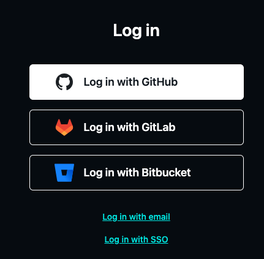
2. add newsite dan import dari githublangsung
   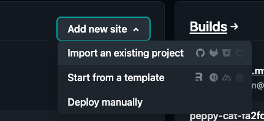
3. deploy with github
   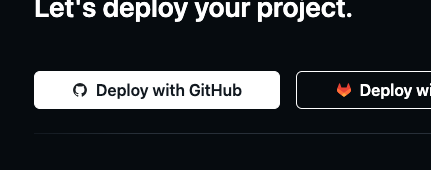
4. cari module yang mau di deploy
   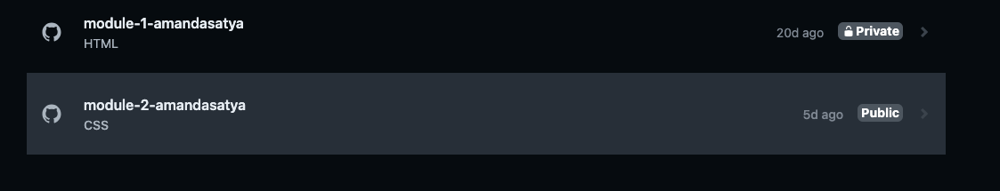
5. lalu klik deploy module
   
6. cari dan beli domain lewat niaga hoster
   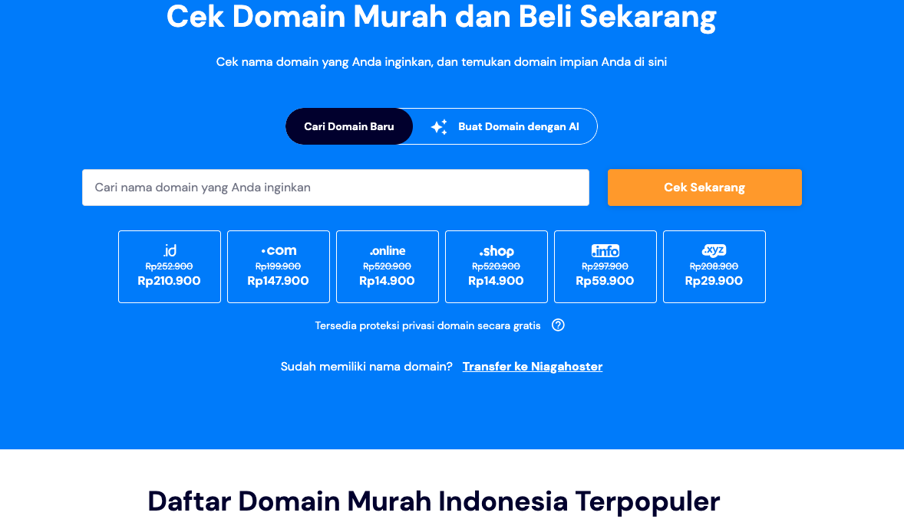
7. setelah selesai membeli kembali ke netlify untuk mengubah default domain yang di berikan netlify menjadi custom name sendiri dengan klik setup custom domain
   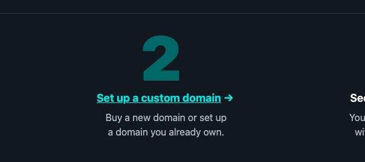
8. masukan nama domain
   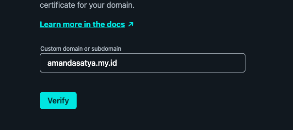
9. setelah memasukan nama domain klik add domain
   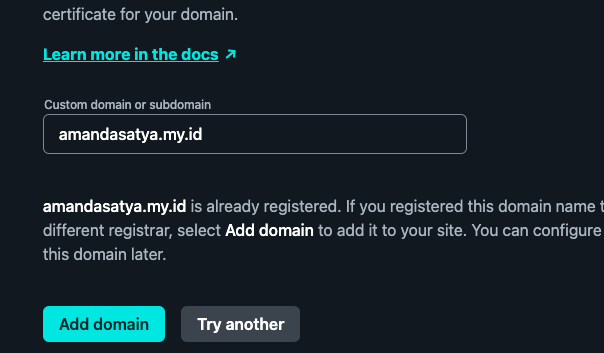
10. kembali ke website niaga hoster masuk ke member area lalu cari dan klik manage domain yang dituju
    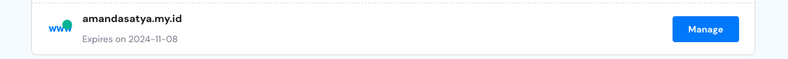
11. cari dns/nameserver lalu klik yang di recomendasikan oleh niagahoster
    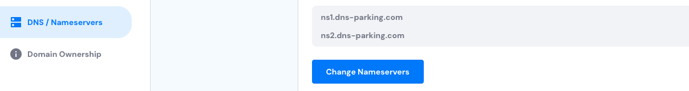
12. ganti nama A record dan cname

    1. Pilih CNAME terlebih dulu. Kemudian, ketikkan subdomain website Anda di Netlify di kolom Hostname. Misalnya, websiteku.netlify.app.
       Simpan pengaturan CNAME tersebut dengan klik Lanjutkan.
       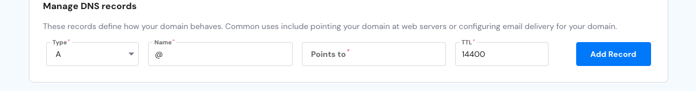
    2. pilih A Record di kolom Record Type dan ketikkan IP address 75.2.60.5 di kolom IPv4.
       Jangan lupa klik Lanjutkan untuk menyimpan pengaturan A record.
       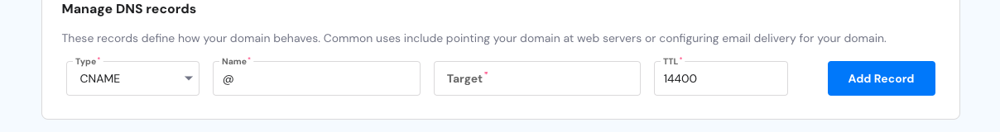

13. Cara custom domain Netlify sudah selesai. Anda hanya perlu menunggu propagasi 2×24 jam agar domain Anda sepenuhnya terhubung dengan website di Netlify.
