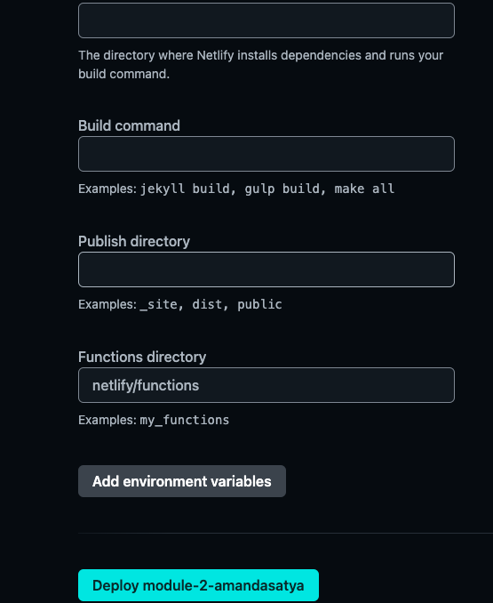

Documentation untuk connect dari netlify ke custom domain

1. register di netlify
   
2. add newsite dan import from github
   
3. deploy with github
   
4. find the module
   
5. then click deploy module
   
6. find and buy domain from niagahoster
   
7. after purchased, back to netlify. change the default domain in netlify, to change default domain from netlify, click setup custom domain
   
8. enter the domain name
   
9. after named the domain, click add domain
   
10. back to niagahoster, and enter to member area, and click your domain and click manage domain
    
11. find dns/nameserver and click change name server that niagahoster recomending
    
12. change A record and CNAME

    1. clik CNAME first and click the subdomain, fill your netlify website in subdomain form, EG.websiteku.netlify.app.
       save the CNAME setings, and click Add record
       
    2. click A record in record coloumn, and search IPv4 and fill with (85.2.60.5)
       dont forget to save the settings of A record!
       

13. your custom domain has done, wait patiently, proximately (2x24)hours,for your domain connect to netlify
